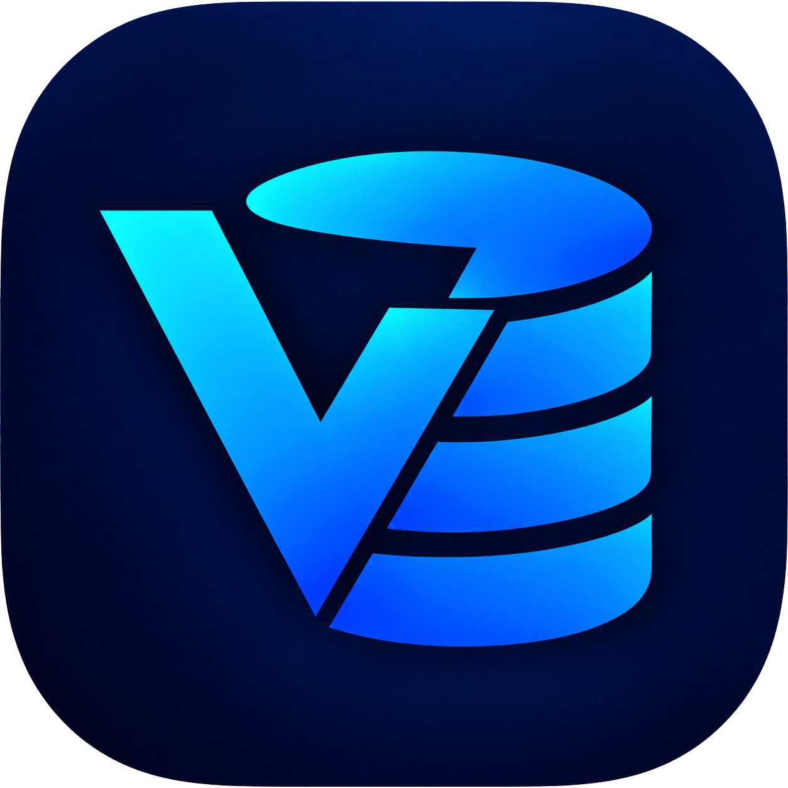

# ⚡ VoltDB

<p align="center">
  <b>A modern, fast, and native macOS database client for MySQL built with SwiftUI & Swift Concurrency.</b>
</p>

<p align="center">
  
</p>

<p align="center">
  <a href="#features">Features</a> •
  <a href="#requirements">Requirements</a> •
  <a href="#installation">Installation</a> •
  <a href="#building-from-source">Building from Source</a> •
  <a href="#keyboard-shortcuts">Keyboard Shortcuts</a> •
  <a href="#architecture">Architecture</a> •
  <a href="#contributing">Contributing</a> •
  <a href="#license">License</a>
</p>

---

## 🌟 Features

- **🚀 100% Native & Lightweight**: Built strictly in Swift with SwiftUI and AppKit. Instant launch times, low memory footprint, and silky smooth 120Hz ProMotion performance.
- **⚡ Async Non-Blocking Engine**: Powered by Apple's `Swift NIO` and Vapor's `mysql-nio` for fast, asynchronous query execution and high throughput.
- **🎨 Rich SQL Editor**:
  - Multi-tab query workflow with independent execution state and auto-restoration.
  - Schema-aware autocompletion (`table.` suggestions for columns, tables, databases, functions, and SQL keywords).
  - Context-aware syntax highlighting (SQL keywords, table names, columns, functions, strings, and comments).
  - Quick line manipulation: `⌘X` to cut line, `⌘C` to copy line, `⌘D` to duplicate line.
  - SQL formatting (`⌘⇧I`) and automatic statement extraction.
- **📊 Interactive Data Grid & Tabbed Results**:
  - Multi-statement query execution into dedicated output result tabs.
  - Result pinning to preserve specific query outputs across executions.
  - High-performance virtualized grid view with column sorting and pagination (up to 500+ rows/page).
  - In-place cell editing with transaction tracking (`⌘S` Commit / `⌘⇧Z` Rollback).
  - Visual SQL filter builder (`SmartFilterView`) for constructing multi-condition WHERE clauses.
  - Quick export & clipboard actions: copy cells/rows as **CSV**, formatted **JSON**, or executable **SQL INSERT** statements.
- **🔍 Schema & Structure Inspector**:
  - Table Structure viewer: detailed views for **Columns** (data types, nullability, defaults, keys), **Indexes**, and **Foreign Keys**.
  - Collapsible schema sidebar with instant search and automatic grouping (User Databases vs System Schemas).
  - Side Inspector Panel (`⌘⌥I`): table storage metrics (engine, collation, row count, data & index sizes) and query execution statistics.
- **🔒 Connection Manager & Security**:
  - Multiple saved connection profiles with environment tagging (`PROD` badges and safeguards).
  - **SSH Tunneling**: Connect securely through SSH bastions (password or private key authentication with passphrase).
  - **Master Password Vault**: AES-256-GCM / PBKDF2 encryption for database passwords and SSH passphrases with auto-lock protection.
  - Native SSL / TLS encryption support.
- **🧭 Command Palette**: Quick fuzzy table & view navigation across all databases (`⌘P`).
- **🪟 Multi-Window Workspaces**: Independent workspace window per database connection.

---

## 🖥️ Requirements

- **macOS**: 14.0 (Sonoma) or later
- **Xcode**: 15.0+ or **Swift Toolchain**: 5.9+ (if building from source)
- **Architecture**: Apple Silicon (M1/M2/M3/M4) & Intel x86_64

---

## 📥 Installation

1. Download the latest **`VoltDB-v...-arm64.dmg`** installer from [GitHub Releases](https://github.com/codingg-in/VoltDB/releases).
2. Open the disk image and drag **`VoltDB.app`** into your **`Applications`** folder.
3. **Clear the macOS quarantine attribute** (required for first launch — see below).

> [!WARNING]
> **Required First-Launch Step: Bypass macOS Gatekeeper**
>
> If macOS displays *"VoltDB can't be verified and can't be opened"*, it is because VoltDB is an open-source project without a paid Apple Developer certificate. macOS automatically quarantines binaries downloaded from the web.
>
> To open VoltDB, run this command once in **Terminal**:
> ```bash
> xattr -d com.apple.quarantine /Applications/VoltDB.app
> ```
> *Note: This safely removes only the download quarantine flag without altering application code or permissions.*

---

## 🛠️ Building from Source

If you prefer to compile and run VoltDB from source:

### 1. Clone the repository
```bash
git clone https://github.com/codingg-in/VoltDB.git
cd VoltDB
```

### 2. Build and Launch
Build and run the app directly using the included launch script:
```bash
chmod +x run.sh
./run.sh
```

Or run via Swift Package Manager:
```bash
swift run
```

---

## 🏗️ Architecture & Tech Stack

```
VoltDB/
├── Sources/VoltDB/
│   ├── Database/          # MySQL connection pooling & NIO query execution
│   ├── Models/            # Schema, queries, configs, and transaction tracking
│   ├── State/             # Observable SwiftUI state containers
│   ├── Storage/           # Master Password Vault, Keychain, session persistence
│   ├── Theme/             # Dark/Light syntax theme & token styling
│   ├── Views/             # Modular SwiftUI components & AppKit integrations
│   ├── Helpers/           # Keyboard monitors, Window accessors, SQL parsers
│   └── Resources/         # AppIcon and asset bundle
├── Package.swift          # SPM configuration
└── run.sh                 # Fast build, bundle, sign, & launch script
```

---

## 🤝 Contributing

Contributions are welcome! To contribute:

1. **Fork** the repository.
2. Create your feature branch (`git checkout -b feature/awesome-feature`).
3. Commit your changes (`git commit -m "feat: Add awesome feature"`).
4. Push to your branch (`git push origin feature/awesome-feature`).
5. Open a **Pull Request**.

Please ensure your code builds cleanly (`swift build`) and adheres to Swift style guidelines.

---

## 📄 License

Distributed under the **GNU Affero General Public License v3.0 (AGPL-3.0)**. See [`LICENSE`](LICENSE) for more information.
